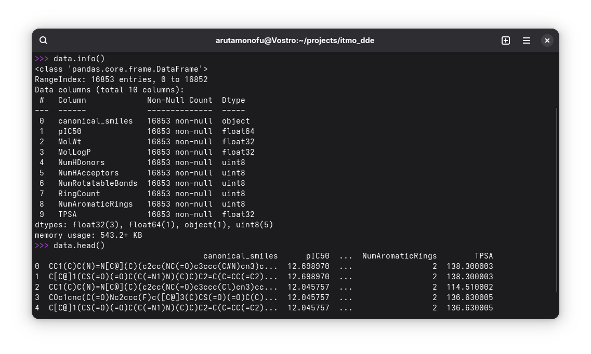

# Учебный проект в рамках дисциплины «Инжиниринг управления данными» ИТМО

## Данные

Данные — молекулы (в формате SMILES) и их молекулярные дескрипторы:

- молекулярная масса,
- коэффициент распределения октанол/вода,
- количество доноров водородной связи,
- количество акцепторов водородной связи,
- количество вращающихся связей,
- количество колец,
- количество ароматических колец,
- топологическая полярная площадь поверхности.



Источник данных — объединённая выгрузка из химических баз данных:

- ChEMBL: https://www.ebi.ac.uk/chembl/ ([документация API](https://www.ebi.ac.uk/chembl/api/data/docs))
- PubChem: https://pubchem.ncbi.nlm.nih.gov/ ([документация API](https://pubchem.ncbi.nlm.nih.gov/docs/pug-rest-tutorial))

## Установка

```bash
conda env create -f environment.yml
```

## Исполнение

```bash
python main.py
```